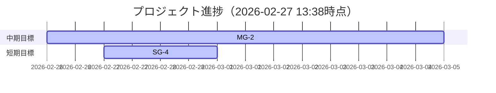

# Milestone Plan

## 基本情報

- **最終更新**: 2026-02-27T13:38:50+09:00
- **更新者**: Codex (Orchestrator)

---

## 長期目標（Someday / 月次〜四半期）

### LG-1: 最短でゲーム完成へ到達する運用への収束

- **ゴール**: テスト過多を抑え、完成直結タスクを優先して実装速度を上げる。
- **期限目安**: 2026-03
- **状態**: 進行中
- **進捗**: 84%
- **関連マイルストーン**: MG-2

---

## 中期目標（Later / 1〜2週間）

### MG-2: Phase 5 Vertical Slice Closeout

- **ゴール**: 020-024を実装収束し、Unity復帰後に025で一括検証してDONE化する。
- **期限目安**: 2026-03-05
- **状態**: 進行中
- **進捗**: 80%
- **含まれるタスク**: TASK_020, TASK_021, TASK_022, TASK_023, TASK_024, TASK_025
- **完了基準**:
  - [x] TASK_020 COMPLETED
  - [x] TASK_021 / TASK_022 COMPLETED_CORE
  - [x] TASK_023 COMPLETED
  - [x] TASK_024 実装完了
  - [ ] TASK_025 一括手動検証でDONE昇格確定

---

## 短期目標（Next / 今日〜数日）

### SG-4: Task024完了後の検証移行準備

- **ゴール**: TASK_024反映を固定し、Unity復帰後にTASK_025へ即時移行できる状態にする。
- **対象タスク**: TASK_025
- **完了基準**:
  - [x] TASK_024完了のSSOT反映
  - [x] compile gate再確認（0 Warning / 0 Error）
  - [ ] TASK_025実施条件（Unity復帰）を満たしたら即時着手

---

## 現在地マップ

---

## 振り返りログ（KPT）

### 2026-02-27: TASK_024 完了反映

**Keep（続けること）**:
- Unity不可期間は compile gate を主検証として前進する

**Problem（課題）**:
- Unity手動検証は deferred のため、Done昇格に時差が出る

**Try（次に試すこと）**:
- TASK_025の検証テンプレートを先行整備し、復帰当日に即実行できるようにする

**優先度変更**:
- TASK_025 をUnity復帰後の即時実行タスクとして固定

---

## 履歴

- 2026-02-26 15:02: 起票3件 + 最短完成ルート同期
- 2026-02-26 18:44: TASK_023完了反映 + compile再確認
- 2026-02-27 13:38: TASK_024完了反映 + compile再確認（0 Warning / 0 Error）
