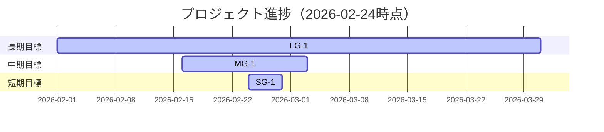

# Milestone Plan

## 基本情報

- **最終更新**: 2026-02-24T19:00:07+09:00
- **更新者**: Codex (Orchestrator)

---

## 長期目標（Someday / 月次〜四半期）

### LG-1: Unity運用とOrchestrator駆動の安定化

- **ゴール**: Phase 2A/2B の残タスクを閉じ、再開可能な運用状態を常時維持する。
- **期限目安**: 2026-03
- **状態**: 進行中
- **進捗**: 70%
- **関連マイルストーン**: MG-1, MG-2

---

## 中期目標（Later / 1〜2週間）

### MG-1: Phase 2A Camera Closeout

- **ゴール**: Camera基盤タスク（013/014/015/016/017/018/019）を証跡付きで収束し、手動検証保留を管理可能にする。
- **期限目安**: 2026-03-03
- **状態**: 進行中
- **進捗**: 57%
- **含まれるタスク**: TASK_013, TASK_014, TASK_015, TASK_016, TASK_017, TASK_018, TASK_019
- **完了基準**:
  - [ ] TASK_013 / TASK_014 / TASK_015 の状態同期（DONE or 追加実装）
  - [x] TASK_016 / TASK_017 / TASK_018 / TASK_019 の証跡確認
  - [ ] 手動PlayMode検証（Layer B）結果の反映

---

## 短期目標（Next / 今日〜数日）

### SG-1: P6 Closeoutと再開ライン整備

- **ゴール**: リモート同期後にP6報告を確定し、次フェーズで迷わない状態にする。
- **対象タスク**: TASK_013, TASK_014, TASK_015
- **完了基準**:
  - [x] リモート取り込み（fetch/pull）
  - [x] MISSION_LOG / WORKFLOW_STATE_SSOT 同期
  - [ ] OPENタスク再分類とWorker再投入方針確定

---

## 現在地マップ

---

## 振り返りログ（KPT）

### 2026-02-24: Phase2A Camera stream 同期

**Keep（続けること）**:
- MISSION_LOG と WORKFLOW_STATE_SSOT を同時更新して次アクションを一本化

**Problem（課題）**:
- 手動PlayMode検証が deferred のまま残るため最終完了判定が遅れる

**Try（次に試すこと）**:
- Layer B 専用の短時間検証セッションを次回先頭で実施する

**優先度変更**:
- TASK_013 / TASK_014 / TASK_015 の棚卸しを High 優先へ再設定

---

## 履歴

- 2026-02-24 19:00: MILESTONE_PLAN.md を初期化
