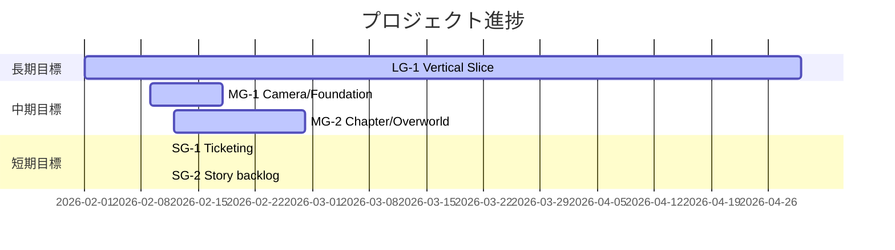

# Milestone Plan

## 基本情報

- **最終更新**: 2026-02-22T06:03:47+09:00
- **更新者**: Codex

---

## 長期目標（Someday / 月次〜四半期）

### LG-1: Vertical Slice 完成

- **ゴール**: Sandbox で「探索→制圧→回収→納品→結果表示」の1サイクルを実装し、15秒映像を撮影可能にする
- **期限目安**: 2026-04
- **状態**: 進行中
- **進捗**: 35%
- **関連マイルストーン**: MG-1, MG-2

---

## 中期目標（Later / 1〜2週間）

### MG-1: Phase 2A Camera/Foundation 完了

- **ゴール**: Camera 基盤の責務分離と基本挙動（1P/3P/シネマティック遷移）を運用可能にする
- **期限目安**: 2026-02-18
- **状態**: 進行中
- **進捗**: 80%
- **含まれるタスク**: TASK_001, TASK_015
- **完了基準**:
  - [ ] CameraManager の責務分離（Mode/Settings/Smoother）
  - [ ] EditMode / PlayMode の主要テスト追加
  - [ ] テスト全通過・ビルド成功

### MG-2: Story Chapter / Overworld 基盤設計

- **ゴール**: チャプターリスト構造とメタ進行を持つオーバーワールド構造を縦切りで実装可能な状態にする
- **期限目安**: 2026-02-28
- **状態**: 進行中
- **進捗**: 20%
- **含まれるタスク**: TASK_016, TASK_017, TASK_018
- **完了基準**:
  - [ ] ChapterDefinition / ChapterCatalog の最小仕様が確定
  - [ ] MetaFlagService の永続化仕様が確定
  - [ ] OverworldDirector と再訪差分フローがタスク分割されている

---

## 短期目標（Next / 今日〜数日）

### SG-1: Camera 基盤タスクを1件起票し Worker 実行可能化

- **ゴール**: 次の実装を止めずに開始できるチケットを OPEN で発行
- **対象タスク**: TASK_001
- **完了基準**:
  - [x] チケットに Focus/Forbidden/DoD/Test Plan/Impact Radar を記載
  - [x] Milestone 紐付け（SG-1 / MG-1）を記載

### SG-2: Story Chapter 仕様をバックログ化

- **ゴール**: 将来実装に向けた縦切りタスクを起票し、優先度と依存を見える化する
- **対象タスク**: TASK_002
- **完了基準**:
  - [x] チャプター / オーバーワールド要件をタスク化
  - [x] 縦切りスライス（S1〜S4）を定義

### SG-3: Camera closeout verification 完了

- **ゴール**: `TASK_015` の EditMode/PlayMode/build の検証証跡を確定して MG-1 を完了に近づける
- **対象タスク**: TASK_015
- **完了基準**:
  - [ ] EditMode/PlayMode/Build の結果が report と ticket に記録されている
  - [ ] `TASK_015` が DONE に更新されている

### SG-4: Story基盤の実装開始

- **ゴール**: `TASK_016` を開始し、`TASK_017` で利用する契約（catalog/metaflag API）を確定する
- **対象タスク**: TASK_016
- **完了基準**:
  - [ ] ChapterDefinition / ChapterCatalog / MetaFlagService の最小契約が実装されている
  - [ ] EditMode中心の契約テストが追加されている

---

## 現在地マップ

---

## 振り返りログ（KPT）

### 2026-02-11: 起票前整備

**Keep（続けること）**:

- 同期直後にローカル差分を整理してからタスク化する運用

**Problem（課題）**:

- プロジェクト本体に tasks/handover 運用ファイルが未整備だった

**Try（次に試すこと）**:

- `docs/tasks/` 運用を固定し、Worker レポートの受け皿を毎タスクで更新する

**優先度変更**:

- Camera 基盤整備（TASK_001）を最優先へ引き上げ

### 2026-02-11: Worker回収と将来仕様の分割

**Keep（続けること）**:

- Worker成果を即時回収してチケットDoDへ反映する運用

**Problem（課題）**:

- Unityプロジェクトが開かれていると batch test が実行できない

**Try（次に試すこと）**:

- Unity Editor内テストを先に実行してから回収フェーズに入る運用を明文化

**優先度変更**:

- Story Chapter基盤（TASK_002）を中期目標 MG-2 として追加
