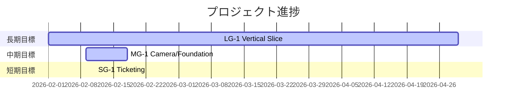

# Milestone Plan

## 基本情報

- **最終更新**: 2026-02-11T20:51:30+09:00
- **更新者**: Codex

---

## 長期目標（Someday / 月次〜四半期）

### LG-1: Vertical Slice 完成

- **ゴール**: Sandbox で「探索→制圧→回収→納品→結果表示」の1サイクルを実装し、15秒映像を撮影可能にする
- **期限目安**: 2026-04
- **状態**: 進行中
- **進捗**: 35%
- **関連マイルストーン**: MG-1, MG-2

---

## 中期目標（Later / 1〜2週間）

### MG-1: Phase 2A Camera/Foundation 完了

- **ゴール**: Camera 基盤の責務分離と基本挙動（1P/3P/シネマティック遷移）を運用可能にする
- **期限目安**: 2026-02-18
- **状態**: 進行中
- **進捗**: 55%
- **含まれるタスク**: TASK_001
- **完了基準**:
  - [ ] CameraManager の責務分離（Mode/Settings/Smoother）
  - [ ] EditMode / PlayMode の主要テスト追加
  - [ ] テスト全通過・ビルド成功

---

## 短期目標（Next / 今日〜数日）

### SG-1: Camera 基盤タスクを1件起票し Worker 実行可能化

- **ゴール**: 次の実装を止めずに開始できるチケットを OPEN で発行
- **対象タスク**: TASK_001
- **完了基準**:
  - [x] チケットに Focus/Forbidden/DoD/Test Plan/Impact Radar を記載
  - [x] Milestone 紐付け（SG-1 / MG-1）を記載

---

## 現在地マップ

---

## 振り返りログ（KPT）

### 2026-02-11: 起票前整備

**Keep（続けること）**:

- 同期直後にローカル差分を整理してからタスク化する運用

**Problem（課題）**:

- プロジェクト本体に tasks/handover 運用ファイルが未整備だった

**Try（次に試すこと）**:

- `docs/tasks/` 運用を固定し、Worker レポートの受け皿を毎タスクで更新する

**優先度変更**:

- Camera 基盤整備（TASK_001）を最優先へ引き上げ
